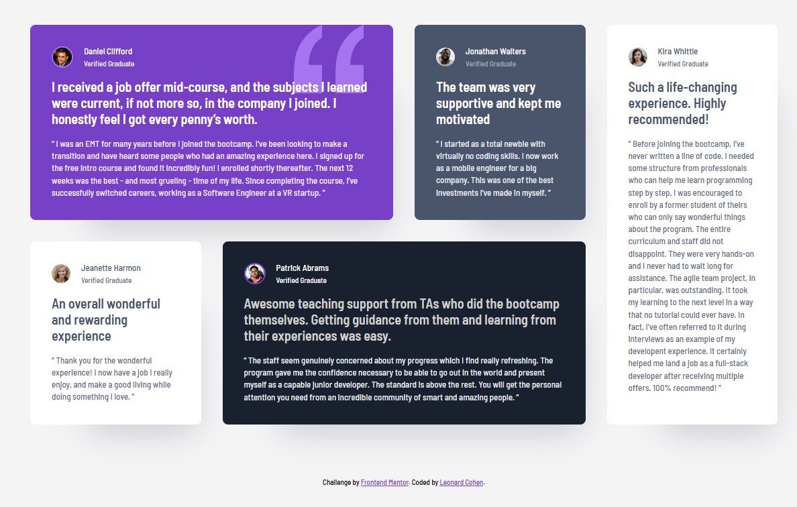

# Frontend Mentor - Testimonials grid section solution

This is a solution to the [Testimonials grid section challenge on Frontend Mentor](https://www.frontendmentor.io/challenges/testimonials-grid-section-Nnw6J7Un7). Frontend Mentor challenges help you improve your coding skills by building realistic projects. 

## Table of contents

- [Overview](#overview)
  - [The challenge](#the-challenge)
  - [Screenshot](#screenshot)
  - [Links](#links)
- [My process](#my-process)
  - [Built with](#built-with)
  - [What I learned](#what-i-learned)
  - [Continued development](#continued-development)
- [Author](#author)

## Overview

### The challenge

Users should be able to:

- View the optimal layout for the site depending on their device's screen size

### Screenshot

### Links

- Solution URL: [https://github.com/lenny131/testimonials-grid-section](https://github.com/lenny131/testimonials-grid-section)
- Live Site URL: [https://lenny131.github.io/testimonials-grid-section/](https://lenny131.github.io/testimonials-grid-section/)

## My process

### Built with

- HTML and CSS
- Sass

### What I learned

I used CSS grid for this project.

### Continued development

I plan on continuing to practice HTML, CSS, and Javascript. I am interested in learning React.

## Author

- Website - [Leonard Cohen](https://leonardmcohen.com)
- Frontend Mentor - [@lenny131](https://www.frontendmentor.io/profile/lenny131)
